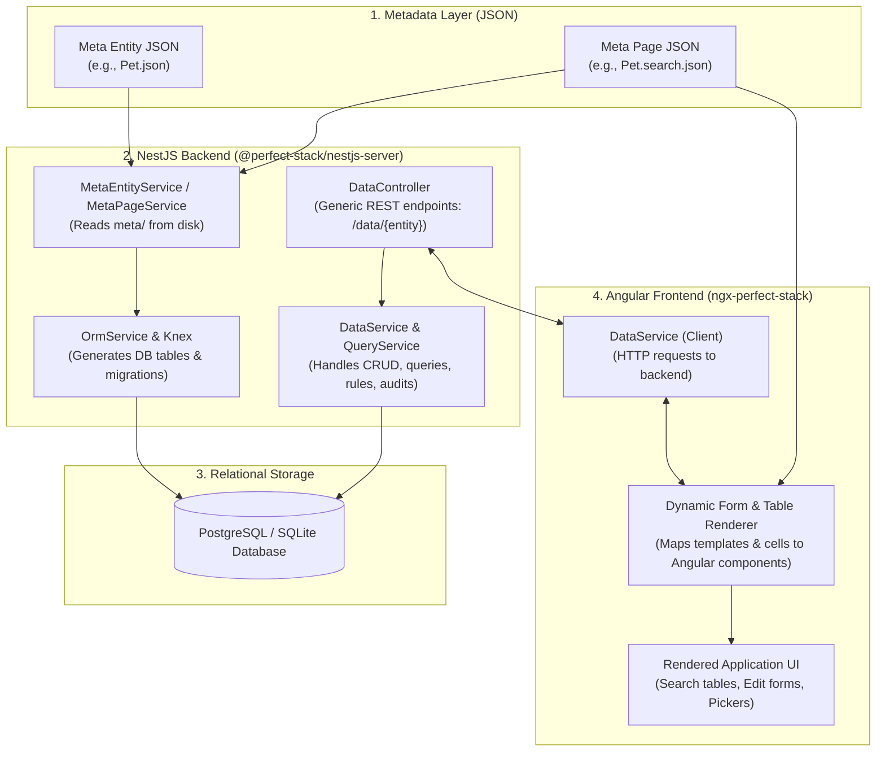

# Perfect-Stack Architecture

> **Living Documentation**: This document is the primary architectural map for the Perfect-Stack platform. It is designed to be easily read and reviewed by humans, as well as serve as an immediate architectural kickstart for AI assistants.
> 
> *Rule*: If any architectural patterns, core abstractions, or directory conventions change, this document must be updated accordingly.

---

## 1. Executive Summary & Core Philosophy

**Perfect-Stack** is a metadata-driven low-code platform and enterprise application stack built on **Angular**, **NestJS**, **Knex/PostgreSQL**, and **Docker**.

### The Core Concept
Instead of hand-coding boilerplate CRUD endpoints, database tables, forms, validation rules, and search pages for every business domain, Perfect-Stack allows you to declare **Metadata** (JSON models). From this declarative metadata, the platform automatically:
1. **Generates & Manages Database Schemas**: Dynamically creates tables, foreign keys, timestamps, and indexes.
2. **Exposes Universal REST & Query APIs**: Provides generic CRUD ([`DataService`](file:///Users/richardperfect/dev/perfect-consulting/perfect-stack/nestjs-server/libs/nestjs-server/src/data/data.service.ts)) and query capabilities ([`QueryService`](file:///Users/richardperfect/dev/perfect-consulting/perfect-stack/nestjs-server/libs/nestjs-server/src/data/query.service.ts)) that interpret entity definitions at runtime.
3. **Renders Dynamic Angular UIs**: Generates rich search screens, view/edit forms, typeaheads, child entity tables, and relationship pickers dynamically via [`ngx-perfect-stack`](file:///Users/richardperfect/dev/perfect-consulting/perfect-stack/angular-workspace/projects/ngx-perfect-stack).

---

## 2. Glossary & Mental Model

When discussing or working with Perfect-Stack, certain terms are frequently used to mean either a **declarative JSON definition** on disk or the **runtime object/page** in action. Understanding this distinction prevents ambiguity:

| Term | Context 1: The "JSON" Definition (Disk/Schema) | Context 2: The Runtime Representation |
| :--- | :--- | :--- |
| **Meta Entity** | The JSON definition file located in `meta/entities/<EntityName>.json` (e.g. [`Pet.json`](file:///Users/richardperfect/dev/perfect-consulting/perfect-stack/testing/vet-clinic/meta/entities/Pet.json)), specifying attributes, types, rules, relationships, and schema options. | The in-memory schema object (`MetaEntity` TypeScript class/interface) or the underlying database table and ORM structure generated from that schema. |
| **Meta Page** | The JSON layout definition located in `meta/page/<EntityName>.<pageType>.json` (e.g. [`Pet.search.json`](file:///Users/richardperfect/dev/perfect-consulting/perfect-stack/testing/vet-clinic/meta/page/Pet.search.json) or [`Pet.view_edit.json`](file:///Users/richardperfect/dev/perfect-consulting/perfect-stack/testing/vet-clinic/meta/page/Pet.view_edit.json)), defining grid cells, templates, and UI components. | The active Angular view rendered in the browser (e.g., the search page or edit dialog currently being used by the user). |
| **Meta Attribute** | The attribute object in an entity's JSON (name, label, type, visibility, rules, comparisonField, relationshipTarget). | The runtime property on the entity model and corresponding column in the database table. |
| **Meta Menu** | The navigation JSON file in `meta/menu/*.json` defining sidebar and header menus. | The rendered navigation bar component in the Angular client. |
| **Meta Role** | The authorization JSON file in `meta/role/*.json` declaring permissions and entity/page access rules. | The runtime security context evaluating whether the active user can view/edit specific records or pages. |
| **Template & Cell** | The layout structures inside a Meta Page JSON specifying grid layout (width, height, component type). | The rendered layout container (form, table, tab) and UI input widget (Text, Select, Date, Checkbox, etc.) on screen. |
| **Data vs. Metadata** | **Metadata** describes the structure, types, rules, and layout of the application (`meta/`). | **Data** represents the actual business records (e.g. a specific Pet named "Fido") stored in the database and fetched via `DataService`. |

> [!NOTE]
> In conversation or issues, references like *"check the Pet Meta Entity"* or *"update the Pet Meta Page"* may mean either editing the JSON file in `meta/` or debugging the runtime component/service that consumes it. Pay attention to whether the problem is declarative (schema/layout) or programmatic (runtime/renderer).

---

## 3. Monorepo Directory Layout

The repository is structured as a multi-package monorepo without a single root `package.json`. Each subproject manages its own dependencies and configuration:

```text
perfect-stack/
├── Architecture.md                   # This architectural reference guide
├── README.md                         # Project overview and roadmap
│
├── .agents/skills/
│   └── AGENTS.md                     # Engineering standards, architecture rules & agent directives
│
├── angular-workspace/                # Angular monorepo
│   └── projects/
│       ├── ngx-perfect-stack/        # Core Angular UI library (published package)
│       └── vet-clinic-client/        # Symlink to testing/vet-clinic/client demo app
│
├── nestjs-server/                    # NestJS backend library and utilities
│   ├── libs/
│   │   └── nestjs-server/src/        # Core backend service library (@perfect-stack/nestjs-server)
│   └── media/                        # Local media/file storage folders
│
├── nestjs-client/                    # Generated/client SDK for NestJS APIs
│
└── testing/                          # Dedicated testing subprojects
    ├── test-server/                  # Fast BDD integration tests for backend services
    └── vet-clinic/                   # Full-stack reference implementation & E2E suite
        ├── client/                   # Angular frontend application
        ├── server/                   # NestJS backend application
        └── meta/                     # Canonical metadata definitions (entities, pages, menu, roles)
```

---

## 4. Key Subsystems & Core Locations

### 4.1. Core Frontend Library: [`ngx-perfect-stack`](file:///Users/richardperfect/dev/perfect-consulting/perfect-stack/angular-workspace/projects/ngx-perfect-stack/src/lib)
Located at [`angular-workspace/projects/ngx-perfect-stack/src/lib`](file:///Users/richardperfect/dev/perfect-consulting/perfect-stack/angular-workspace/projects/ngx-perfect-stack/src/lib):
- **[`data/`](file:///Users/richardperfect/dev/perfect-consulting/perfect-stack/angular-workspace/projects/ngx-perfect-stack/src/lib/data)**:
  - `data-search/`: Dynamic search pages, criteria filters, sorting, and result tables.
  - `data-edit/`: Dynamic create/edit forms with automatic validation, dirty checking, and save handlers.
  - `data-service/`: Angular HTTP client communicating with backend `DataService` and `QueryService`.
- **[`template/`](file:///Users/richardperfect/dev/perfect-consulting/perfect-stack/angular-workspace/projects/ngx-perfect-stack/src/lib/template)**:
  - Layout rendering engine: Interprets templates, cell coordinates, and widget component bindings across header, form, table, card, and formList (card-based form lists for child collections).
  - Property sheets, attribute palettes, and template controllers.
- **[`meta/`](file:///Users/richardperfect/dev/perfect-consulting/perfect-stack/angular-workspace/projects/ngx-perfect-stack/src/lib/meta)**:
  - TypeScript types and models for entities, pages, menus, roles, and schema versions.
- **[`menu-bar/`](file:///Users/richardperfect/dev/perfect-consulting/perfect-stack/angular-workspace/projects/ngx-perfect-stack/src/lib/menu-bar)** & **[`authentication/`](file:///Users/richardperfect/dev/perfect-consulting/perfect-stack/angular-workspace/projects/ngx-perfect-stack/src/lib/authentication)**:
  - Dynamic navigation menu bar and JWT authentication guards/interceptors.

### 4.2. Core Backend Library: [`nestjs-server`](file:///Users/richardperfect/dev/perfect-consulting/perfect-stack/nestjs-server/libs/nestjs-server/src)
Located at [`nestjs-server/libs/nestjs-server/src`](file:///Users/richardperfect/dev/perfect-consulting/perfect-stack/nestjs-server/libs/nestjs-server/src):
- **[`data/`](file:///Users/richardperfect/dev/perfect-consulting/perfect-stack/nestjs-server/libs/nestjs-server/src/data)**:
  - [`data.service.ts`](file:///Users/richardperfect/dev/perfect-consulting/perfect-stack/nestjs-server/libs/nestjs-server/src/data/data.service.ts): Universal CRUD engine handling creates, updates, soft/permanent deletes, cascading children, and audit logs.
  - [`query.service.ts`](file:///Users/richardperfect/dev/perfect-consulting/perfect-stack/nestjs-server/libs/nestjs-server/src/data/query.service.ts): Dynamic query engine executing criteria queries, depth-bounded include queries (`buildFindOneIncludes`), recursive CTE hierarchy trees with child collections, eager loading of relations, pagination, and sorting.
  - [`data.controller.ts`](file:///Users/richardperfect/dev/perfect-consulting/perfect-stack/nestjs-server/libs/nestjs-server/src/data/data.controller.ts): REST endpoints for entity operations.
- **[`meta/`](file:///Users/richardperfect/dev/perfect-consulting/perfect-stack/nestjs-server/libs/nestjs-server/src/meta)**:
  - `meta-entity/`: MetaEntity service and controller; reads entity JSON definitions from disk and generates runtime schema.
  - `meta-page/`, `meta-menu/`, `meta-role/`: Manages page layouts, navigation menus, and permission models.
- **[`orm/`](file:///Users/richardperfect/dev/perfect-consulting/perfect-stack/nestjs-server/libs/nestjs-server/src/orm) & [`knex/`](file:///Users/richardperfect/dev/perfect-consulting/perfect-stack/nestjs-server/libs/nestjs-server/src/knex)**:
  - Database connection providers, dynamic table migration/creation, and SQL query generation for PostgreSQL and SQLite.
- **[`audit/`](file:///Users/richardperfect/dev/perfect-consulting/perfect-stack/nestjs-server/libs/nestjs-server/src/audit)**, **[`file/`](file:///Users/richardperfect/dev/perfect-consulting/perfect-stack/nestjs-server/libs/nestjs-server/src/file)**, **[`media/`](file:///Users/richardperfect/dev/perfect-consulting/perfect-stack/nestjs-server/libs/nestjs-server/src/media)**:
  - Built-in audit tracking, file uploads, S3/local media storage, and background task management.

### 4.3. Canonical Metadata Showcase: [`testing/vet-clinic/meta`](file:///Users/richardperfect/dev/perfect-consulting/perfect-stack/testing/vet-clinic/meta)
When you need to understand how metadata should be defined or look up real-world examples, **this is the gold standard reference**:
- **[`entities/`](file:///Users/richardperfect/dev/perfect-consulting/perfect-stack/testing/vet-clinic/meta/entities)**:
  - Examples: [`Pet.json`](file:///Users/richardperfect/dev/perfect-consulting/perfect-stack/testing/vet-clinic/meta/entities/Pet.json), [`Owner.json`](file:///Users/richardperfect/dev/perfect-consulting/perfect-stack/testing/vet-clinic/meta/entities/Owner.json), [`Species.json`](file:///Users/richardperfect/dev/perfect-consulting/perfect-stack/testing/vet-clinic/meta/entities/Species.json), [`Clinic.json`](file:///Users/richardperfect/dev/perfect-consulting/perfect-stack/testing/vet-clinic/meta/entities/Clinic.json).
  - Demonstrates: Primitive attributes (`Text`, `Identifier`, `Date`), relationships (`ManyToOne`, `OneToMany`), validation rules, and typeahead search configurations.
- **[`page/`](file:///Users/richardperfect/dev/perfect-consulting/perfect-stack/testing/vet-clinic/meta/page)**:
  - Examples: [`Pet.search.json`](file:///Users/richardperfect/dev/perfect-consulting/perfect-stack/testing/vet-clinic/meta/page/Pet.search.json), [`Pet.view_edit.json`](file:///Users/richardperfect/dev/perfect-consulting/perfect-stack/testing/vet-clinic/meta/page/Pet.view_edit.json), [`Protocol.tree.json`](file:///Users/richardperfect/dev/perfect-consulting/perfect-stack/testing/vet-clinic/meta/page/Protocol.tree.json).
  - Demonstrates: Page layouts, cell spans, template types (`form`, `table`), and component bindings (`Select`, `Text`, `Date`).
- **[`menu/`](file:///Users/richardperfect/dev/perfect-consulting/perfect-stack/testing/vet-clinic/meta/menu)** and **[`role/`](file:///Users/richardperfect/dev/perfect-consulting/perfect-stack/testing/vet-clinic/meta/role)**:
  - Real-world menu structures and role-based permissions.

### 4.4. Testing Harnesses: [`testing/`](file:///Users/richardperfect/dev/perfect-consulting/perfect-stack/testing)
Testing is decoupled into two independent sub-projects:
1. **[`testing/test-server`](file:///Users/richardperfect/dev/perfect-consulting/perfect-stack/testing/test-server)**:
   - Fast, headless BDD integration tests using Cucumber against SQLite.
   - Tests backend service behaviors directly (`DataService`, `QueryService`, `RuleService`, sorting indexes, cascade deletes).
   - Run via: `cd testing/test-server && npm test`.
2. **[`testing/vet-clinic`](file:///Users/richardperfect/dev/perfect-consulting/perfect-stack/testing/vet-clinic)**:
   - Full-stack end-to-end browser automation suite using Playwright and Cucumber.
   - Runs a dedicated NestJS backend server and Angular frontend to test end-user workflows against the Vet Clinic application.
   - Run via: `cd testing/vet-clinic && npm test`.

---

## 5. End-to-End Execution Flow



---

## 6. Key Developer Workflows & Commands

### Building and Publishing Locally (`yalc`)
Local packages are shared between modules during development using `yalc`:
- **Build Backend Library**:
  ```bash
  cd nestjs-server
  npm run build:lib
  # Or watch and push automatically:
  npm run build:lib:yalc
  ```
- **Build Frontend Library**:
  ```bash
  cd angular-workspace
  npm run build:lib
  # Or watch and push automatically:
  npm run build:lib:yalc
  ```

### Running Tests
- **Run Backend Service Integration Tests**:
  ```bash
  cd testing/test-server
  npm test
  ```
- **Run End-to-End Browser Tests**:
  ```bash
  cd testing/vet-clinic
  npm test
  ```

---

## 7. Architecture Evolution Rule
Whenever:
1. New core modules or services are added to `nestjs-server` or `ngx-perfect-stack`,
2. Metadata schemas (attributes, page layout conventions, rule engines) are modified, or
3. Test suites and directory layouts are reorganized,

**This `Architecture.md` file must be updated** to ensure both human developers and AI assistants retain an accurate, up-to-date mental model of the system.
