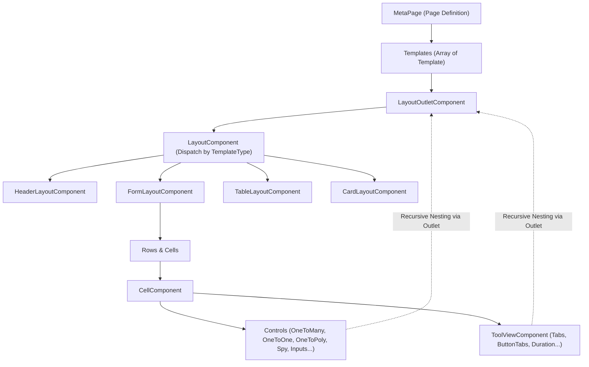
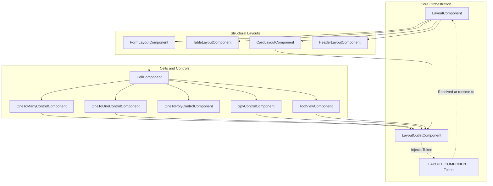

# Layout Subsystem (`ngx-perfect-stack`)

> **Dynamic Metamodel-Driven Layout Engine**
> Responsible for transforming declarative JSON metadata (`MetaPage`, `Template`, `Row`, `Cell`) into fully reactive Angular UI hierarchies.

---

## 1. Architectural Purpose & Metamodel Hierarchy

The **Layout Subsystem** is the core rendering engine of `ngx-perfect-stack`. Instead of writing hardcoded Angular templates for each entity or screen, the application defines pages as metadata. The layout subsystem interprets this metadata at runtime, constructs reactive form bindings (`FormGroup`), and renders responsive layout structures.

### The Rendering Pipeline



1. **`MetaPage`**: Represents an entire page/screen (e.g. view, edit, search). It contains an array of `Template` definitions.
2. **`Template`**: Represents a major visual section of a page. Characterized by `type: TemplateType` (`form`, `table`, `card`, `header`) and bound to a schema entity (`metaEntityName`) and optional form path (`binding`).
3. **`Row` & `Cell`**: Within a `FormLayout`, content is organized into grid rows and cells. A `Cell` configures label positioning (`LabelLayoutType`), column spans, and points either to an attribute control or a tool.
4. **`Control`**: Renders data inputs and handles relationships (`one-to-many`, `one-to-one`, `one-to-poly`).
5. **`Tool`**: Renders contextual page tooling (`tool-view`, `tab-tool`, `button-tabs-tool`, `duration-tool`).

---

## 2. Architectural History & Circular Dependency Resolution (Approach B)

### The NG3003 Compiler Issue

In Angular libraries compiled with `ng-packagr` under partial compilation mode, template references generate static imports in the produced `.d.ts` and `.mjs` code.

Originally, child layouts (`CardLayout`), controls (`OneToManyControl`, `OneToOneControl`, `SpyControl`), and tools (`TabTool`, `ButtonTabsTool`) recursively embedded `<lib-layout>` inside their templates to render nested templates. This resulted in a **14-component circular dependency chain**:

```
LayoutComponent -> FormLayoutComponent -> CellComponent -> OneToManyControlComponent -> LayoutComponent (CYCLE)
```

The Angular compiler failed with:
```
NG3003: One or more import cycles would need to be created to compile this component,
which is not supported by the current compiler configuration.
```

### The Circuit Breaker Pattern (Approach B)

To break this compile-time import cycle permanently while preserving runtime recursion, the subsystem uses the **Circuit Breaker Pattern** via dependency injection:

1. **`LAYOUT_COMPONENT` (`InjectionToken<Type<any>>`)**: An injection token defined in `layout.token.ts` with no dependencies on `LayoutComponent`.
2. **`LayoutOutletComponent` (`<lib-layout-outlet>`)**: An intermediary component that injects `LAYOUT_COMPONENT` and dynamically creates the concrete layout component using `ViewContainerRef.createComponent()`.
3. **`ngx-perfect-stack.module.ts`**: Provides the token at the module root:
   ```typescript
   export function layoutComponentFactory(): Type<any> {
     return LayoutComponent;
   }
   
   @NgModule({
     providers: [
       { provide: LAYOUT_COMPONENT, useFactory: layoutComponentFactory }
     ]
   })
   ```

### Directed Acyclic Graph (DAG)

By routing all recursive template invocations through `<lib-layout-outlet>`, the template dependency graph becomes a strict **Directed Acyclic Graph (DAG)**:



---

## 3. Directory Layout & Subsystem Topology

The directory structure separates components by their distinct architectural roles:

```
layout/
├── README.md                           # This architecture and design guide
├── layout.component.ts                 # Root dispatcher component + backward-compatibility re-exports
├── layout.component.html               # Switches between layouts based on template.type
├── layout.component.css
│
├── layout-outlet/                      # Circular-dependency circuit breaker
│   ├── layout.token.ts                 # InjectionToken<Type<any>> definition
│   └── layout-outlet.component.ts      # Dynamic host container
│
├── layouts/                            # Structural page layout components
│   ├── header-layout/                  # Page title, subtitle, and action buttons
│   ├── form-layout/                    # Grid rows, columns, and form cell rendering
│   ├── table-layout/                   # Tabular listing with pagination & sorting
│   └── card-layout/                    # Responsive card containers
│
├── cell/                               # Layout grid cell wrapper
│   └── cell.component.ts               # Cell label positioning and control router
│
├── controls/                           # Complex and relational layout controls
│   ├── one-to-many-control/            # Master-detail sub-template lists
│   ├── one-to-one-control/             # Embedded single related entity forms
│   ├── one-to-poly-control/            # Polymorphic discriminator child views
│   └── spy-control/                    # Debugging and model inspection control
│
└── tool-view/                          # Interactive page tools and utility views
    ├── tool-view.component.ts          # Tool dispatcher component
    ├── button-tabs-tool/               # Button-style tab switcher
    ├── duration-tool/                  # Time duration tracking and display
    └── tab-tool/                       # Tabbed view container for sub-templates
```

### Relocated Components

- **`PermissionCheckComponent`**: Moved to `src/lib/meta/role/permission-check/`. It belongs to the security/authorization domain, not layout.
- **`BackLinkComponent`**: Moved to `src/lib/data/data-edit/back-link/`. It belongs to page navigation/editing workflows, not general layout templates.

---

## 4. Critical Design Rules & Invariants

When extending or maintaining this subsystem, the following invariants **must** be preserved:

### Rule 1: Never Use `<lib-layout>` Inside Child Layouts or Controls
> [!CAUTION]
> Never import `LayoutComponent` or use `<lib-layout>` inside child layouts (`layouts/`), `CellComponent`, `controls/`, or `tool-view/`.
>
> **Always use `<lib-layout-outlet>`:**
> ```html
> <!-- CORRECT -->
> <lib-layout-outlet
>   [template]="childTemplate"
>   [formGroup]="childFormGroup"
>   [ctx]="ctx">
> </lib-layout-outlet>
> 
> <!-- INCORRECT: Causes NG3003 cycle compiler crash -->
> <lib-layout
>   [template]="childTemplate"
>   [formGroup]="childFormGroup"
>   [ctx]="ctx">
> </lib-layout>
> ```

### Rule 2: FormGroup Context Propagation
> [!IMPORTANT]
> Always pass `[formGroup]="formGroup"` down through the outlet:
> - In `layout.component.html`, `<lib-form-layout>` receives `[formGroup]="formGroup"`.
> - Nested child layouts (such as inside a `CardLayout` or `OneToOneControl`) operate within a row-specific or child-specific `FormGroup`. Passing the `formGroup` input directly ensures child components bind to their local form slice rather than falling back to `ctx.formMap`.

### Rule 3: Outlet CSS Transparency (`display: contents`)
> [!NOTE]
> `LayoutOutletComponent` must retain `:host { display: contents; }` in its styles. This ensures the host tag does not generate a box in the CSS rendering tree, preventing it from breaking Bootstrap grid (`row`, `col-*`) or flexbox containers.

### Rule 4: Handling Label Layout Defaults
> [!NOTE]
> In `FormLayoutComponent`, `isShowLabelTop(cell)` must treat `undefined` as `LabelLayoutType.Top` (the default). If a cell has no explicit `labelLayout` configured, it must default cleanly to `Top` rather than falling through to "Unknown Label Layout".

---

## 5. Adding New Layouts, Controls, or Tools

### Adding a New Layout Type (e.g. `KanbanLayout`)
1. Create `layouts/kanban-layout/kanban-layout.component.ts` (with `.html` and `.css`).
2. If nested templates are needed within the layout, use `<lib-layout-outlet>`.
3. Add the layout to `LayoutComponent` template switch in `layout.component.html`:
   ```html
   <ng-container *ngSwitchCase="'kanban'">
     <lib-kanban-layout [template]="template" [formGroup]="formGroup" [ctx]="ctx"></lib-kanban-layout>
   </ng-container>
   ```
4. Register the new component in `ngx-perfect-stack.module.ts` (declarations & exports).
5. Re-export the component from `layout.component.ts`.

### Adding a New Tool (e.g. `WizardTool`)
1. Create `tool-view/wizard-tool/wizard-tool.component.ts`.
2. Use `<lib-layout-outlet>` if the tool hosts child templates (e.g., wizard steps).
3. Route to the new tool inside `tool-view.component.html`.
4. Register and export in `ngx-perfect-stack.module.ts` and `layout.component.ts`.

---

## 6. Storybook & Documentation Preparation

The architecture is prepared for future Storybook component cataloging and Compodoc API generation.

### TSDoc Conventions
Each component file uses standard JSDoc/TSDoc blocks describing:
- Component role and usage.
- `@Input()` properties with description and expected types.
- `@Output()` event contracts.

### Future Storybook Setup Pattern
When Storybook is introduced, stories for child layouts and controls can be tested in complete isolation by providing a mock or real `LAYOUT_COMPONENT`:

```typescript
// Example: card-layout.component.stories.ts (Future pattern)
import { Meta, StoryObj, moduleMetadata } from '@storybook/angular';
import { CardLayoutComponent } from './card-layout.component';
import { LayoutOutletComponent } from '../../layout-outlet/layout-outlet.component';
import { LAYOUT_COMPONENT } from '../../layout-outlet/layout.token';
import { LayoutComponent } from '../../layout.component';

export default {
  title: 'Layout/CardLayout',
  component: CardLayoutComponent,
  decorators: [
    moduleMetadata({
      declarations: [CardLayoutComponent, LayoutOutletComponent, LayoutComponent],
      providers: [
        { provide: LAYOUT_COMPONENT, useValue: LayoutComponent }
      ]
    })
  ]
} as Meta<CardLayoutComponent>;
```
